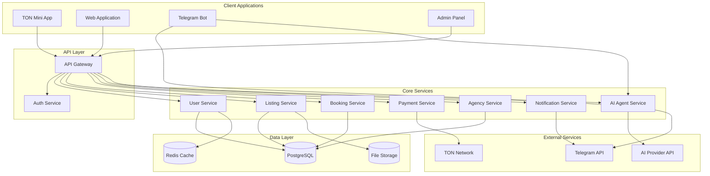

# Design Document

## Overview

Маркетплейс представляет собой комплексную систему, построенную на
микросервисной архитектуре с единым API Gateway и множественными клиентскими
приложениями. Система использует RSPack для сборки фронтенд приложений,
интегрируется с TON blockchain для платежей и включает ИИ-агента для
автоматизации поддержки клиентов.

## Architecture

### High-Level Architecture



### Technology Stack

**Frontend:**

- RSPack для сборки всех клиентских приложений
- React 18 с TypeScript
- Tailwind CSS для стилизации
- Zustand для управления состоянием
- React Query для работы с API

**Backend:**

- Node.js с Express/Fastify
- TypeScript
- PostgreSQL для основных данных
- Redis для кэширования и сессий
- AWS S3/MinIO для файлов

**Infrastructure:**

- Docker для контейнеризации
- Nginx как reverse proxy
- PM2 для управления процессами Node.js

## Components and Interfaces

### 1. API Gateway

**Responsibilities:**

- Маршрутизация запросов к микросервисам
- Аутентификация и авторизация
- Rate limiting и мониторинг
- CORS обработка

**Key Endpoints:**

```typescript
interface APIRoutes {
  // Authentication
  'POST /auth/login': LoginRequest -> AuthResponse
  'POST /auth/register': RegisterRequest -> AuthResponse
  'POST /auth/refresh': RefreshRequest -> AuthResponse

  // Listings
  'GET /listings': ListingFilters -> ListingResponse[]
  'POST /listings': CreateListingRequest -> ListingResponse
  'PUT /listings/:id': UpdateListingRequest -> ListingResponse
  'DELETE /listings/:id': void -> SuccessResponse

  // Bookings
  'POST /bookings': CreateBookingRequest -> BookingResponse
  'GET /bookings/user/:userId': void -> BookingResponse[]
  'PUT /bookings/:id/status': UpdateStatusRequest -> BookingResponse

  // Payments
  'POST /payments/initiate': PaymentRequest -> PaymentResponse
  'POST /payments/webhook': WebhookPayload -> void

  // AI Agent
  'POST /ai/chat': ChatRequest -> ChatResponse
  'GET /ai/conversations/:userId': void -> ConversationResponse[]
  'POST /ai/manager-intervention': InterventionRequest -> void
}
```

### 2. User Service

**Responsibilities:**

- Управление пользователями и профилями
- Ролевая система (User, Agency, Manager, Admin)
- Профили и настройки

**Data Models:**

```typescript
interface User {
  id: string
  email: string
  phone?: string
  telegramId?: string
  role: UserRole
  profile: UserProfile
  createdAt: Date
  updatedAt: Date
  isActive: boolean
}

interface UserProfile {
  firstName: string
  lastName: string
  avatar?: string
  location?: Location
  rating: number
  reviewsCount: number
  verificationStatus: VerificationStatus
}

enum UserRole {
  USER = 'user',
  AGENCY = 'agency',
  MANAGER = 'manager',
  ADMIN = 'admin',
}
```

### 3. Listing Service

**Responsibilities:**

- Управление объявлениями
- Категории и фильтрация
- Модерация контента
- Поиск и индексация

**Data Models:**

```typescript
interface Listing {
  id: string
  ownerId: string
  title: string
  description: string
  category: ListingCategory
  type: ListingType
  price: Price
  location: Location
  images: string[]
  availability: Availability
  features: Feature[]
  status: ListingStatus
  createdAt: Date
  updatedAt: Date
}

enum ListingCategory {
  BIKES = 'bikes',
  CARS = 'cars',
  EQUIPMENT = 'equipment',
}

enum ListingType {
  RENT = 'rent',
  SALE = 'sale',
  BOTH = 'both',
}

interface Price {
  amount: number
  currency: string
  period?: PricePeriod // для аренды
}
```

### 4. Booking Service

**Responsibilities:**

- Управление бронированиями и заказами
- Календарь доступности
- Статусы заказов
- Интеграция с платежами

**Data Models:**

```typescript
interface Booking {
  id: string
  listingId: string
  renterId: string
  ownerId: string
  type: BookingType
  startDate: Date
  endDate?: Date // для аренды
  totalAmount: number
  status: BookingStatus
  paymentId?: string
  agencyServices?: AgencyService[]
  createdAt: Date
  updatedAt: Date
}

enum BookingStatus {
  PENDING = 'pending',
  CONFIRMED = 'confirmed',
  ACTIVE = 'active',
  COMPLETED = 'completed',
  CANCELLED = 'cancelled',
  DISPUTED = 'disputed',
}
```

### 5. Agency Service

**Responsibilities:**

- Управление агентствами и их услугами
- Назначение услуг к объявлениям
- Расчет комиссий
- Координация с владельцами

**Data Models:**

```typescript
interface Agency {
  id: string
  userId: string
  name: string
  description: string
  services: AgencyServiceType[]
  coverage: Location[]
  rating: number
  commissionRate: number
  isVerified: boolean
}

interface AgencyServiceType {
  id: string
  name: string
  description: string
  basePrice: number
  category: ServiceCategory
}

enum ServiceCategory {
  DELIVERY = 'delivery',
  EMERGENCY = 'emergency',
  MAINTENANCE = 'maintenance',
  INSURANCE = 'insurance',
}
```

### 6. AI Agent Service

**Responsibilities:**

- Обработка чатов с клиентами
- Интеграция с внешними AI API
- Система промптов и контекста
- Логирование для менеджеров

**Data Models:**

```typescript
interface Conversation {
  id: string
  userId: string
  messages: Message[]
  context: ConversationContext
  status: ConversationStatus
  assignedManagerId?: string
  createdAt: Date
  updatedAt: Date
}

interface Message {
  id: string
  role: MessageRole
  content: string
  timestamp: Date
  metadata?: MessageMetadata
}

enum MessageRole {
  USER = 'user',
  AI = 'ai',
  MANAGER = 'manager',
}

interface ConversationContext {
  currentListing?: string
  userIntent?: string
  previousBookings?: string[]
  customPrompts?: string[]
}
```

## Data Models

### Database Schema

**Users Table:**

```sql
CREATE TABLE users (
  id UUID PRIMARY KEY DEFAULT gen_random_uuid(),
  email VARCHAR(255) UNIQUE NOT NULL,
  phone VARCHAR(20),
  telegram_id VARCHAR(50),
  password_hash VARCHAR(255),
  role user_role NOT NULL DEFAULT 'user',
  profile JSONB NOT NULL,
  is_active BOOLEAN DEFAULT true,
  created_at TIMESTAMP DEFAULT NOW(),
  updated_at TIMESTAMP DEFAULT NOW()
);
```

**Listings Table:**

```sql
CREATE TABLE listings (
  id UUID PRIMARY KEY DEFAULT gen_random_uuid(),
  owner_id UUID REFERENCES users(id),
  title VARCHAR(255) NOT NULL,
  description TEXT,
  category listing_category NOT NULL,
  type listing_type NOT NULL,
  price JSONB NOT NULL,
  location JSONB NOT NULL,
  images TEXT[],
  availability JSONB,
  features JSONB,
  status listing_status DEFAULT 'pending',
  created_at TIMESTAMP DEFAULT NOW(),
  updated_at TIMESTAMP DEFAULT NOW()
);
```

**Bookings Table:**

```sql
CREATE TABLE bookings (
  id UUID PRIMARY KEY DEFAULT gen_random_uuid(),
  listing_id UUID REFERENCES listings(id),
  renter_id UUID REFERENCES users(id),
  owner_id UUID REFERENCES users(id),
  type booking_type NOT NULL,
  start_date TIMESTAMP NOT NULL,
  end_date TIMESTAMP,
  total_amount DECIMAL(10,2) NOT NULL,
  status booking_status DEFAULT 'pending',
  payment_id VARCHAR(255),
  agency_services JSONB,
  created_at TIMESTAMP DEFAULT NOW(),
  updated_at TIMESTAMP DEFAULT NOW()
);
```

## Error Handling

### Error Response Format

```typescript
interface ErrorResponse {
  error: {
    code: string
    message: string
    details?: any
    timestamp: string
    requestId: string
  }
}
```

### Error Categories

1. **Validation Errors (400)** - Неверные входные данные
2. **Authentication Errors (401)** - Проблемы с аутентификацией
3. **Authorization Errors (403)** - Недостаточно прав
4. **Not Found Errors (404)** - Ресурс не найден
5. **Business Logic Errors (422)** - Нарушение бизнес-правил
6. **Rate Limit Errors (429)** - Превышение лимитов
7. **Server Errors (500)** - Внутренние ошибки сервера

### Error Handling Strategy

- Централизованная обработка ошибок в API Gateway
- Логирование всех ошибок с контекстом
- Graceful degradation для внешних сервисов
- Retry механизмы для временных сбоев
- Circuit breaker для защиты от каскадных отказов

## Testing Strategy

### Unit Testing

- Jest для всех JavaScript/TypeScript компонентов
- Покрытие кода не менее 80%
- Моки для внешних зависимостей
- Тестирование бизнес-логики сервисов

### Integration Testing

- Тестирование API endpoints
- Тестирование взаимодействия с базой данных
- Тестирование интеграций с внешними сервисами
- Docker Compose для тестовой среды

### End-to-End Testing

- Playwright для веб-приложения
- Тестирование критических пользовательских сценариев
- Автоматизированное тестирование в CI/CD

### Performance Testing

- Load testing с помощью Artillery или k6
- Мониторинг производительности API
- Тестирование под нагрузкой для критических endpoints

### Security Testing

- OWASP ZAP для сканирования уязвимостей
- Тестирование аутентификации и авторизации
- Валидация входных данных
- Тестирование защиты от CSRF и XSS атак
